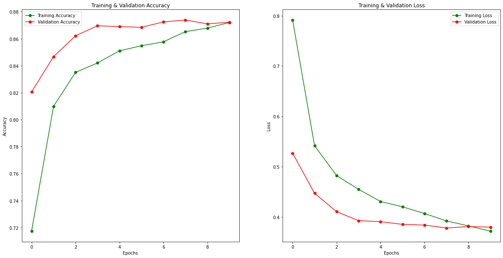

# Leaf Disease Classification using Deep Learning

## Introduction

I originally wrote this code for Cassava Leaf Disease Classification Competition on Kaggle where the task was to classify a given image of a crop into one of the 5 categories (4 classes representing different diseases and 1 class for no-disease).

I did my best to write a very generalised piece of PyTorch Multi-class Image classification code that will work on any of the said type of application with little modification.

I have also made a [full notebook](https://www.kaggle.com/heyytanay/torch-multi-model-trainer-amp-augmentations) showing the entire training process using Visual Transformer Models, on Kaggle.

## Code Walkthrough

The Code in this repository is structured as follows:

```
train.py
src/
 | -augments.py
 | -bitemp_loss.py
 | -config.py
 | -dataloader.py
 | -models.py
 | -trainer.py
```

A brief explanation to what each file does is down below:

* `train.py`: This file is the entry file that you will be running. It binds together all the code in all the files and runs the training and validation loops. In most cases, you will have to just change the dataloader a bit (more on that later) and then run this script with changed locations and names, of course.
  
* `augments.py`: This file contains the Augmentations (by using [albumentations](https://albumentations.ai/) framework) for training and validation data. This is very data specific and I would recommend you to change it your needs.
  
* `bitemp_loss.py`: This file contains the Implementations of [Bi-Tempered Logistic Loss](https://ai.googleblog.com/2019/08/bi-tempered-logistic-loss-for-training.html) in PyTorch. The reason it's here is because this loss function worked better than other built-in loss functions on this data.

* `config.py`: This file contains a Configuration class which has a dictionary that contains the image size, number of test-time augmentations and amount of weight-decay. This is here because the code-base is big and changing hyper-parameters like these are harder to do one-by-one so changing just one value in this file will do that job.

* `dataloader.py`: This file contains the Dataloader logic. For any task, you will have to do at-least some modifications with the class inside of the file like changing the data paths, and image reading sequence, etc.

* `models.py`: This file contains all the different model architectures that I fine-tuned to my needs. Every different architecture's class does one and only one thing: It loads a model using the `timm` library and replaces it's last Linear layers with a new layers that has $n_{neurons} = n_{classes}$. This can be left as is and no modification is required.

* `trainer.py`: This file has the main `Trainer` class. I have taken the standard pytorch training and validation routines and put them inside a class with nice tqdm progress bars and some memory optimizations. Now if you, for example want to train your model, you will just have to initialize a `Trainer` instance and then do something like:

```python
# For training
trainer.train_one_cycle()

# For validation
trainer.valid_one_cycle()
```

The code in this repository is pretty self-sufficient if you have had some experience with pytorch using image data and fine-tuning pre-trained image models.

## Training the Model

If you want to train the model on this data as-is, then you would typically have to perform 2 steps:

### 1. Getting the Data right

First, download the data from [here](https://www.kaggle.com/c/cassava-leaf-disease-classification/data). 

Now, take the downloaded `.zip` file and extract it into a new folder: `input/`.

Make sure the `input/` folder is at the same directory level as the `train.py` file.

### 2. Training the Model

If you have done the above steps right, then just running the `train.py` script should not produce any errors.

To run training, open the terminal and change your working directory to the same level as the `train.py` file.

**[Optional]: If you don't have the requirements installed, do:**

```shell
$ pip install -r requirements.txt
```

Now, for training do:

```shell
$ python train.py
```

This should start a training in a few seconds and you should see a progress bar.

If you are having any problems related to anything, please open an Issue and I will be happy to help!

## Training Results and Conclusion

Below is the plot of results when trained on Resnext50_32x4d with Image Size = 512 and loss being Bi-Temp loss.



This model was just trained for 10 epochs.

**I hope you find my work useful! If you do, then please Star ⭐ this repository!**